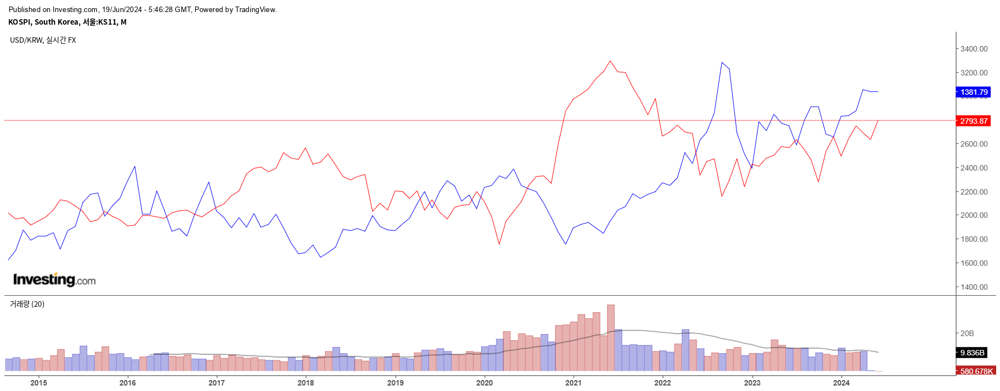

# 4th-time_series-Finance_pred
- 프로젝트 이름
   - Finance_pred
- 프로젝트 주제 간단한 소개
    - 딥러닝 모델을 이용한 코스피 지수와 원/달러 환율 시계열 데이터 기반 금융 예측 모델 개발
- 팀원과 담당업무
  - 김주화,이상준
       - 데이터 수집 및 정제, 데이터베이스 설계 및 관리, 데이터 전처리 및 변환 작업, 데이터 파이프라인 구축,   
         데이터 분석 및 통계적 모델링 시계열 예측 모델 개발 및 검증, 오버피팅 문제 해결을 위한 실험 설계 및 수행, 모델 성능 평가 및 튜닝

# 모델링 기법 선정 보고서

## 1. 프로젝트 주제

딥러닝 모델을 이용한 코스피 지수와 원/달러 환율 시계열 데이터 기반 금융 예측 모델 개발

- 프로젝트의 목적 및 목표

  
  
    - 코스피 지수와 원/달러 환율의 미래 값을 예측하여 투자 결정을 지원하는 고성능 금융 예측 모델을 개발
    - 다양한 모델링 기법을 비교하여 가장 높은 정확도를 가진 예측 모델을 선정하고 그 성능을 분석
- 프로젝트가 해결하고자 하는 문제와 그 중요성
    - 금융 시장의 변동성 예측,거시적 경제 예측
    - 정확한 금융 예측은 투자 위험을 줄이고 자산 관리의 효율성을 높이며, 투자자와 금융 기관의 전략적 의사 결정을 지원함
        
- 예상되는 결과와 영향
    - 결과 : 코스피 지수와 원/달러 환율의 단기 예측 모델
    - 영향 : 투자자와 금융 기관이 보다 정확한 예측을 통해 최적의 투자 결정을 내릴 수 있음

## 1. 데이터 설명
- 사용 데이터 설명:코스피 지수와 원/달러 환율 시계열 데이터 (2003~2024/06/05)
    - 데이터 출처
        - 라이브러리 사용
            - import FinanceDataReader as fdr : FinanceDataReader-[FinanceData/FinanceDataReader: Financial data reader (github.com)](https://github.com/FinanceData/FinanceDataReader)
            - USD/KRW, KOSPI, 2003~2024/06/05, 각각 약 5000개의 데이터, 총 10000개의 데이터
    - 데이터 타입: 시계열 데이터
    - 데이터 크기:
      훈련 데이터: 80%,테스트 데이터: 20%
    
- 데이터 전처리 과정 및 방법
    - 데이터 클리닝: 결측값 제거
    - 데이터 변환: MinMaxScaler를 사용한 정규화
    - 데이터 증강: 시계열 윈도우 기법을 사용하여 데이터 생성
    - 종가를 기준으로 예측모델 생성
## 1. 모델링 기법 후보
- 고려된 모델링 기법
     -LSTM (Long Short-Term Memory)
      GRU (Gated Recurrent Unit)
      Transformer 기반 모델 (TimeGPT)
    
    - LSTM과 GRU: 단일 Sequential 구조
      Transformer: Seq2Seq 구조

    - Pretrained 모델을 사용한 경우 고려한 모델들
        - Transformer 기반 모델 (TimeGPT)

### 1. 모델 선정 기준 및 모델링 기법들 비교
- 모델 선정 기준
    - 성능 지표 (ex: 정확도, Loss 점수, F1 점수 등 )
 
      
             
  
         

    - 기타 지표(ex: 학습 시간, 학습환경-GPU 성능 및 사용여부, 메모리 )
- 각 모델의 선정 기준 적합성
    - MSE (Mean Squared Error), MAE (Mean Absolute Error)

- 각 모델의 장단점 분석
    - LSTM
        장점: 긴 시계열 데이터 처리에 강점
        단점: 학습 시간과 메모리 사용량이 높음

    - GRU
        장점: LSTM보다 적은 파라미터로 유사한 성능 제공
        단점: 매우 긴 시계열 데이터에서는 LSTM보다 성능이 낮을 수 있
      
    - TimeGPT
        장점: 복잡한 패턴 인식에 강점, 최신 기술 적용
        단점: 높은 메모리 사용량과 학습 시간
      
## 1. 선정된 기법
    1. 최종 선정 모델링 기법
        1. TimeGPT
        - 선정된 모델의 구조, 이름
            Nixtla에서 개발한 시계열 예측을 위한 모델, TimeGPT
    2. 선정 이유
        동시에 3가지 모델로 지표들을 예측하여 빠른 의사결정을 하도록 함
        최상의 성능 지표 (낮은 MSE 및 MAE)
        복잡한 패턴 인식에 강점

   
    
    3. 선정 모델에 대한 설명
     - 모델 구조: Transformer 기반 모델 (TimeGPT)
        - 모델 구조
        - 모델의 아키텍처
          - 입력 레이어: 시계열 데이터 (30일)
            중간 레이어: Multi-head Attention, Feedforward Neural Network
            출력 레이어: 예측 값 (5일)

### 학습률, 배치 크기 등 조정

  학습데이터의 크기와 배치크키에 따라 예측치가 실제값과 가깝게 예측되는 것을 확인 할 수 있었음.    
  변수들은 모두 통일하여 같은 값으로 모델별 예측치, 정확도 등을 파악함.

