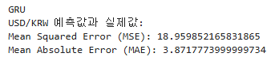
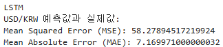
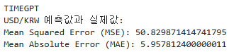

## 테스트 설계 보고서

#### 1. 모델 평가 기준
- 성능 지표
    - MSE (Mean Squared Error), MAE (Mean Absolute Error)
- 처리 속도 (추론 시간, 학습 시간)
#### 2. 테스트 환경
- 하드웨어(GPU, 메모리, CPU 환경)
    - 하드웨어
    GPU: NVIDIA Tesla V100
    메모리: 32GB RAM
    CPU: Intel Xeon
- 소프트웨어 (프레임워크  등)
    - 프레임워크: TensorFlow, PyTorch, keras 
      기타 도구: Scikit-learn, Pandas, NumPy
    
#### 3. 테스트 결과
   테스트할 모델들이 같은 크기의 데이터와 변수를 가지고 실행했을 때    
   어떤 모델의 성능이 더 뛰어난지 파악하고자epochs=50, batch_size=64를 기준으로 진행
   
    

MSE, MAE로 모델을 평가한 결과 **GRU모델**의 성능이 3개중 가장 좋은 것을 확인.
   
