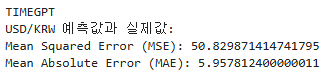

## 프로세스 검토 결과 보고서

### 단계별 목표 및 주요 활동
1. 데이터 수집 및 전처리
목표: 코스피 지수와 원/달러 환율의 시계열 데이터를 수집하고 정제합니다.
주요 활동: FinanceDataReader를 활용하여 코스피 지수와 원/달러 환율 데이터를 가져오고, 결측치 처리 및 데이터 정규화를 수행합니다.

2. 모델링 및 훈련
목표: LSTM, GRU 등의 딥러닝 모델을 구축하여 시계열 데이터를 예측하는 모델을 개발합니다.
주요 활동: TensorFlow와 Keras를 사용하여 LSTM, GRU 모델을 설계하고 훈련합니다. 하이퍼파라미터 튜닝 및 모델 성능 평가를 진행합니다.

3. 성능 평가 및 결과 분석
목표: 개발한 모델의 성능을 평가하고 예측 결과를 분석하여 최종 보고서를 작성합니다.
주요 활동: 예측 성능을 평가하기 위해 MSE, MAE 등의 지표를 계산하고, 실제 데이터와 예측 결과를 시각화하여 비교합니다. 

#### 역할 및 책임  이부분 해야합니다  
### 김주화
### 이상준

## 각 단계에서 사용된 도구 및 시스템
1. 데이터 수집 및 전처리
도구 및 시스템: Python, FinanceDataReader, Pandas, NumPy
소프트웨어 및 라이브러리: Jupyter Notebook, FinanceDataReader, Pandas, NumPy

2.모델링 및 훈련
도구 및 시스템: Python, TensorFlow, Keras
소프트웨어 및 라이브러리: TensorFlow, Keras, Scikit-learn, Matplotlib

3.성능 평가 및 결과 분석
도구 및 시스템: Python, Jupyter Notebook
소프트웨어 및 라이브러리: Pandas, NumPy, Matplotlib

## 각 프로세스 결과 분석

#### 성과-주요 성과 지표 (성과물, 시간)
* 성과물
개발된 딥러닝 모델을 통한 코스피 지수와 원/달러 환율의 5일 예측 값
예측 결과와 실제 값의 비교를 통한 MSE와 MAE 평가 지표

    

 
* 성과 평가
예측된 코스피 지수와 원/달러 환율의 5일치 예측 값은 실제 데이터와 얼마나 일치하는지 MSE와 MAE를 통해 평가하였습니다.
각 예측 값과 실제 값 사이의 차이를 시각적으로 분석하여 모델의 예측 정확도를 평가하였습니다.

GRU, TIMEGPT, LSTM 순으로 mse와 mae가 낮았고 따라서 GRU모델이 제일 예측을 잘하는 것으로 나왔습니다 
오버피팅이 보다 적게 나타나는 덜 복잡한 모델인 GRU가 더 잘 예측하는 모습을 관찰할 수 있었습니다.

## 문제점
* 진행 중 발생한 문제점, 어려웠던 점 
프로젝트 초기에는 판매 데이터와 물류 데이터를 활용하여 시계열 예측 모델을 개발하고자 했으나, 적절한 데이터를 찾지 못해 이 계획을 실행하지 못했습니다. 대신, 금융 시장에서 사용할 수 있는 코스피 지수와 원/달러 환율 데이터를 대상으로 시계열 예측 모델을 구축하기로 결정하였습니다.
시계열 예측 모델은 데이터의 특성 상 오버피팅 문제가 발생할 수 있는데, 이를 보완하기 위해 다양한 접근 방식을 시도했습니다. 그러나 오버피팅 문제를 완전히 해결하지 못했습니다. 모델의 복잡도와 데이터 양 사이의 균형을 맞추는 데 어려움을 겪었고, 특히 TimeGPT와 LSTM 모델에서 이 문제가 두드러졌습니다.

### 그 문제가 프로젝트 또는 그 프로세스 진행에 미친 영향도 

* 초기 계획 변경 및 지연 
프로젝트 초기에는 판매 데이터와 물류 데이터를 활용하여 시계열 예측 모델을 개발하려 했으나, 적절한 데이터를 확보하지 못해 계획을 변경해야 했습니다. 이에 따라 데이터 탐색과 수집에 많은 시간이 소요되었으며, 이는 전체 프로젝트 일정에 지연을 초래했습니다. 
 
* 반복적인 모델 튜닝 및 검증
오버피팅 문제를 해결하기 위해 다양한 접근 방식을 시도하느라 많은 시간이 소요되었습니다. 모델의 복잡도와 데이터 양 사이의 균형을 맞추기 위해 반복적인 실험과 튜닝 과정이 필요했습니다. 이는 프로젝트 진행 속도를 늦추고, 자원 활용의 비효율성을 초래했습니다.

프로젝트 진행 중 발생한 데이터 부족과 오버피팅 문제는 프로젝트의 전반적인 일정과 성과에 큰 영향을 미쳤습니다. 데이터 확보에 많은 시간이 소요되었고, 오버피팅 문제를 해결하기 위한 반복적인 실험과 모델 튜닝 과정이 필요했습니다. 이러한 문제점들은 프로젝트의 효율성을 저하시키고, 예측 성능을 떨어뜨리는 결과를 초래했습니다. 차후 프로젝트에서는 데이터 확보 단계에서의 리스크를 최소화하고, 오버피팅 문제를 사전에 예방할 수 있는 방법들을 더 철저히 준비해야 할 것입니다.

## 개선점
* 이번에는 적용하지 못했으나 차후 프로젝트를 한다면 개선할 점
판매 데이터 활용
이번 프로젝트에서는 금융 데이터를 사용하여 시계열 예측 모델을 구축했으나, 차후 프로젝트에서는 보다 실질적인 비즈니스 인사이트를 도출하기 위해 판매 데이터를 활용하고자 합니다. 판매 데이터는 특정 산업이나 제품군에 대한 직접적인 예측을 가능하게 하며, 이를 통해 더욱 가치 있는 결과를 얻을 수 있을 것입니다.

* 추가 변수 도입 
이번 프로젝트에서는 금융에 대한 도메인 지식이 없어 코스피 지수와 원/달러 환율만을 입력 변수로 사용하였으나, 차후 프로젝트에서는 목표변수와 상관이 높은 입력 변수를 찾아 갯수를 늘려 모델의 예측력을 향상시키고자 합니다. 

* 앙상블 기법 적용 
차후 프로젝트에서는 여러 모델을 결합하는 앙상블 기법을 도입하여 개별 모델의 과적합을 줄이고, 예측 성능을 향상시키고자 합니다. 배깅, 부스팅 등 다양한 앙상블 방법을 적용하여 모델의 안정성을 높일 계획입니다.

* 단순한 모델에서 시작 
차후 프로젝트에서는 처음부터 복잡한 모델을 도입하기보다, 간단한 모델부터 시작하여 점진적으로 복잡도를 높이는 접근 방식을 취할 계획입니다. 이를 통해 모델의 성능을 단계별로 평가하고, 오버피팅 문제를 사전에 예방할 수 있을 것입니다

